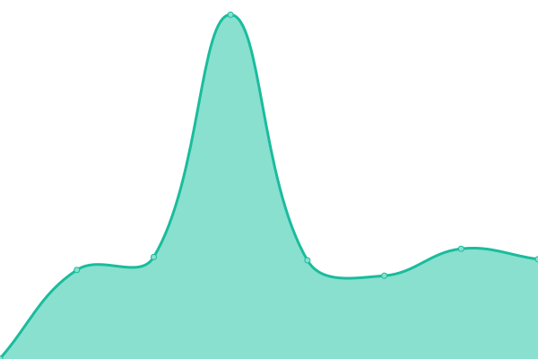
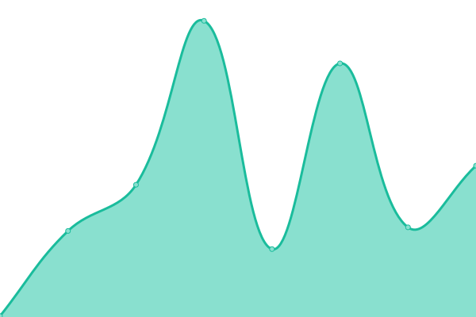
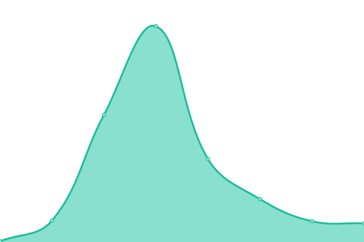

<!--start: status pages-->
<!-- This summary is generated by Upptime (https://github.com/upptime/upptime) -->
<!-- Do not edit this manually, your changes will be overwritten -->
<!-- prettier-ignore -->
| URL | Status | History | Response Time | Uptime |
| --- | ------ | ------- | ------------- | ------ |
|  [homepage](https://kaisugi.me) | 🟩 Up | [homepage.yml](https://github.com/kaisugi/upptime/commits/HEAD/history/homepage.yml) | 

 212ms
     
 | 

<a href="https://kaisugi.github.io/upptime/history/homepage">100.00%</a>
    

|  [Spotify WordCloud](https://spotify-word.cloud) | 🟩 Up | [spotify-word-cloud.yml](https://github.com/kaisugi/upptime/commits/HEAD/history/spotify-word-cloud.yml) | 

 311ms
     
 | 

<a href="https://kaisugi.github.io/upptime/history/spotify-word-cloud">100.00%</a>
    

|  [Qiita Trend API](https://qiita-api.vercel.app) | 🟩 Up | [qiita-trend-api.yml](https://github.com/kaisugi/upptime/commits/HEAD/history/qiita-trend-api.yml) | 

 105ms
     
 | 

<a href="https://kaisugi.github.io/upptime/history/qiita-trend-api">100.00%</a>
    

|  [Zenn Trend API](https://zenn-api.vercel.app) | 🟩 Up | [zenn-trend-api.yml](https://github.com/kaisugi/upptime/commits/HEAD/history/zenn-trend-api.yml) | 

 72ms
     
 | 

<a href="https://kaisugi.github.io/upptime/history/zenn-trend-api">100.00%</a>
    

<!--end: status pages-->

[**Visit our status website →**](https://HelloRusk.github.io/upptime)

## 📄 License

- Powered by: [Upptime](https://github.com/upptime/upptime)
- Code: [MIT](./LICENSE) © [Kaito Sugimoto](hellorusk.net)
- Data in the `./history` directory: [Open Database License](https://opendatacommons.org/licenses/odbl/1-0/)
